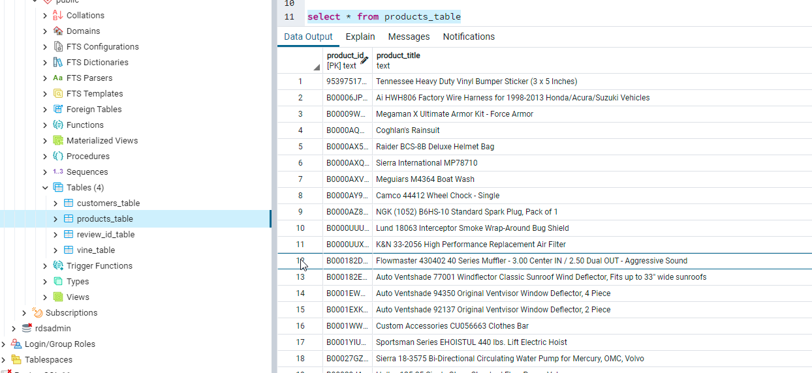

# Amazon_Vine_Analysis
# Module 16 Challenge- _Deliverable 3_

This written analysis contains three sections:

**1. Overview of the analysis**

**2. Results**

**3. Summary**
 
## 1. Overview of the analysis

The aim of the analysis was to analyze Amazon reviews written by members of the paid Amazon Vine program. The Amazon Vine program is a service that allows manufacturers and publishers to receive reviews for their products. Companies pay a small fee to Amazon and provide products to Amazon Vine members, who are then required to publish a review.

In this project **Automotive** dataset was used from `https://s3.amazonaws.com/amazon-reviews-pds/tsv/index.txt` which comprised of automotive related product reviews from Amazon. The goal was to analyze if it would be worth it to subscribe to a Vine program if we were to sell similar products through their platform. The vine review program is an incentive model in which customers are gifted free stuff when they write good reviews. Since the datasets are quite large to save the files locally, PySpark in Google Colab was used to extract, transform, and load (ETL) the data to a AWS RDS inctance and it was connected to my PostgreSQL server to be able to query and extract the finished tables. Then PySpark was used to determine if there is any bias toward favorable reviews from Vine members in the dataset.

## 2. Results

The key steps was first to extract the dataset from an AWS S3 using PySpark in order to transform it and load it to AWS again. There, I the whole dataframe was divided into 4 smaller dataframes for better analysis *(as below)*. These dataframes were then loaded to AWS RDS using a a connection from PySpark to PostgreSQL.

*a. RDS- Customer Table*

*b. RDS- Product Table*

*c. RDS- Review Table*

*d. RDS- Vine Table*

Then, the **Vine Table** was used to perform analysis to filter the best reviews, and see if there were significantly more 5-star reviews in the paid and incentivized (vine) program. The best reviews were those that were highly voted as helpful. For the analysis the vine table was divided into smaller dataframes to run further analysis *(image below)*,

*a. Vine- Automotive*

*b. Vine- Product Table*

*c. Vine- Review Table*

*d. Vine- Customer Table*

*e. Vine*

The results primarily highlight the below major points,

### **a. How many Vine reviews and non-Vine reviews were there?**

There were a total of **24,824** Vine and non-Vine reviews of which **12,840** were five-star reviews.

*a. Total Reviews*

### **b. How many Vine reviews were 5 stars? How many non-Vine reviews were 5 stars?**

There was a total of **33** five-star Vine review and **12,807** five-star non-Vine reviews.

*b. Vine Reviews*

*c. non-Vine Reviews*

### **c. What percentage of Vine reviews were 5 stars? What percentage of non-Vine reviews were 5 stars?**

There was a **40.24%** five-star Vine review and **51.76%** five-star non-Vine reviews.
## 3. Summary

### a. Is there a bias for five-star reviews for the Vine program?

The results above clearly suggests that there is **no clear positivity bias of five-star reviews in the Vine program**. On the contrary, the percentage of five-star reviews in the Vine program is 10 percentage points less than the unpaid program *(40.24% for Vine and 51.76% for non-Vine)*.
### b. One additional analysis for the dataset:

It's curious that the majority of the total reviews in the dataset was five-stars. One further analysis could be to understand the key factors which effect customer staisfaction where we could use the NLP method to extract keywords to identify attributes which compels customers to give five-star reviews.
